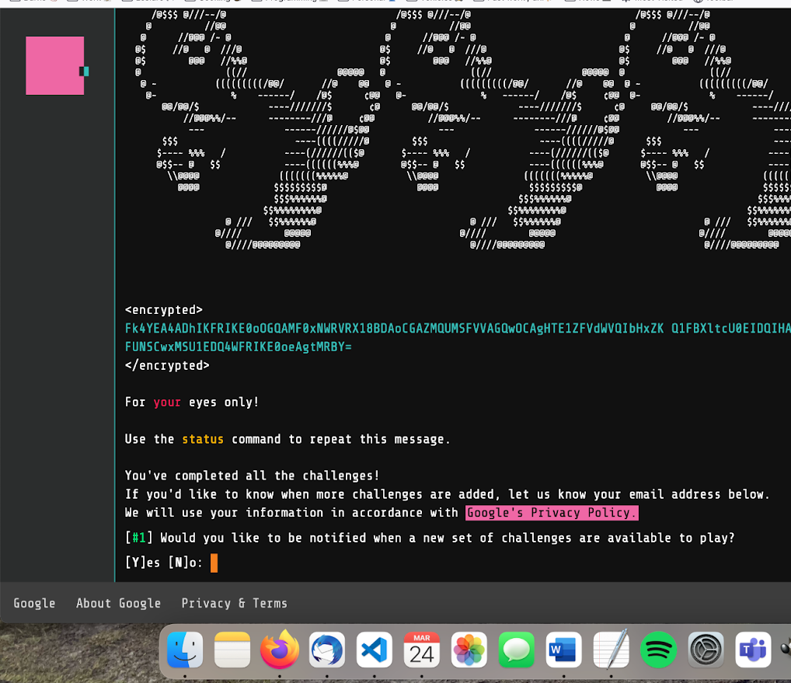

My solutions to the [Google Foobar](https://www.turing.com/kb/foobar-google-secret-hiring-technique) programming/algorithm design challenges. I didn't keep much track of the question descriptions, but you can easily find them online.

